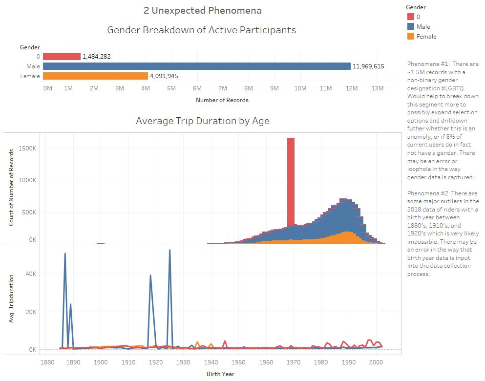

# Tableau_CITI_Bikes

How many trips have been recorded total during the chosen period?

By what percentage has total ridership grown/ how has the proportion of short-term customers and annual subscribers changed?
(Ridership Growth.JPG)

What are the peak hours in which bikes are used during summer months?
(Peak Summer Hours.JPG)

What are the peak hours in which bikes are used during winter months?
(Peak Winter Hours.JPG)

Today, what are the top 10 stations in the city for starting a journey?
(Top Starting Locations.JPG)

Today, what are the top 10 stations in the city for ending a journey?
(Top Ending Locations.JPG)

Today, what are the bottom 10 stations in the city for starting a journey?
(Bottom Starting Locations.JPG)

Today, what are the bottom 10 stations in the city for ending a journey?
(Bottom Ending Locations.JPG)

Today, what is the gender breakdown of active participants/how effective has gender outreach been in increasing female ridership over the timespan?
(Gender Breakdown.JPG)

How does the average trip duration change by age?
(Duration by Age.JPG)

What is the average distance in miles that a bike is ridden?
(Avg Distance per Bike.JPG)

Which bikes (by ID) are most likely due for repair or inspection in the timespan?
(Bikes Due for Inspection.JPG)

How variable is the utilization by bike ID?
(Bike Utilization.JPG)
